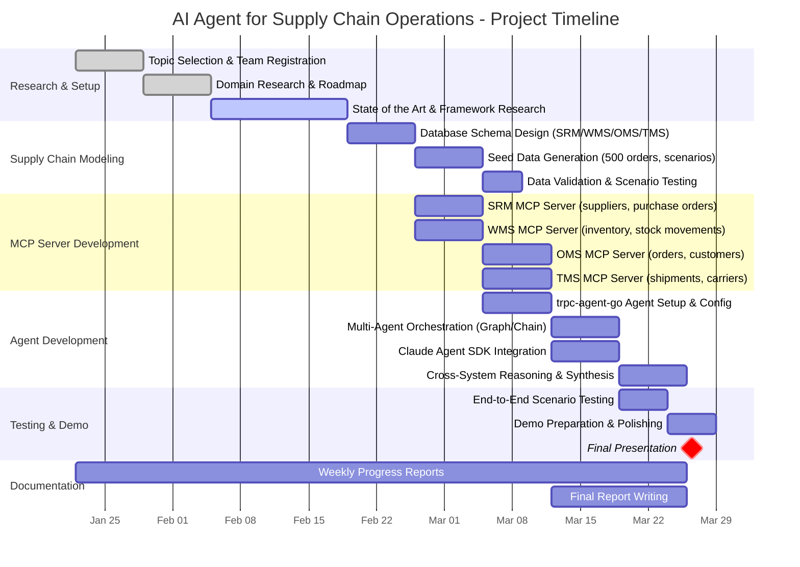

# Week 3 - Progress Report: AI Agent for Supply Chain Operations

LOUIS GRIGNOLA
GAUTHIER SCHMITT
MAEL TELLUS
MATTEO SCHWARZ

**Course:** SE618-1 Logistics
**Focus:** Agentic AI applied to Supply Chain Management
**Date:** February 2026

---

## 1. State of the Art: Agentic AI in Supply Chain Management

### 1.1 Overview

The application of agentic AI -- particularly LLM-based multi-agent systems -- to supply chain management is a rapidly emerging research area (first papers 2023-2024, accelerating in 2025-2026). While industry players such as Walmart, JD.com, SAP, and Microsoft are already deploying solutions, academic research is fragmented across computer science, operations research, and manufacturing engineering. We reviewed 14 relevant papers published between 2023 and 2026.

### 1.2 Research Papers

| # | Paper | Authors | Year | Venue | Key Contribution |
|---|-------|---------|------|-------|-----------------|
| 1 | Agentic LLMs in the Supply Chain: Towards Autonomous Multi-Agent Consensus-Seeking | Jannelli et al. | 2024 | [arXiv](https://arxiv.org/abs/2411.10184) / Int. J. Production Research | Multi-agent consensus framework reducing bullwhip effect in inventory management |
| 2 | Rethinking Supply Chain Planning: A Generative Paradigm (SCPA) | Yin et al. | 2025 | [arXiv](https://arxiv.org/abs/2509.03811) | GenAI-powered planning agent deployed at JD.com -- 22% accuracy improvement |
| 3 | Automating Supply Chain Disruption Monitoring via an Agentic AI Approach | AlMahri et al. | 2026 | [arXiv](https://arxiv.org/abs/2601.09680) | 7 specialized agents for disruption detection -- F1 0.96-0.99, 3.8 min per event |
| 4 | AI Agent Systems for Supply Chains: Structured Decision Prompts and Memory Retrieval (AIM-RM) | Yoshizato et al. | 2026 | [arXiv](https://arxiv.org/abs/2602.05524) / AAMAS 2026 | First LLM-MAS achieving optimal multi-echelon inventory decisions via memory retrieval |
| 5 | InvAgent: LLM-based Multi-Agent System for Inventory Management | Quan & Liu | 2024 | [arXiv](https://arxiv.org/abs/2407.11384) | Zero-shot multi-agent inventory management without RL fine-tuning |
| 6 | Agentic AI Sustainability Assessment for SC Document Insights | Gosmar et al. | 2025 | [arXiv](https://arxiv.org/abs/2511.07097) | ESG assessment: 70-90% energy reduction, 90-97% CO2 reduction vs manual |
| 7 | Multi-Agent RAG for Supply Chain Knowledge Bases | Zhang et al. | 2025 | [arXiv](https://arxiv.org/abs/2506.17484) / ACM KDD 2025 | Transforms unstructured SC communications into RAG knowledge bases (Amazon) |
| 8 | KG + LLM Reasoning for Warehouse Bottleneck Identification | Parekh et al. | 2025 | [arXiv](https://arxiv.org/abs/2507.17273) | Knowledge graphs + LLM agent for DES warehouse analysis |
| 9 | Integrating RAG with Prompt Engineering for SC Solutions | -- | 2025 | [ResearchGate](https://www.researchgate.net/publication/393479215) | Hybrid RAG framework for compliance and inventory anomaly detection |
| 10 | LLMs in SCM: Opportunities and a Case Study | Zheng et al. | 2025 | [IFAC MIM 2025](https://www.sciencedirect.com/science/article/pii/S2405896325012595) | Delivery delay prediction via LLM + decentralized agent-based system |
| 11 | Large Language Models for Supply Chain Optimization (OptiGuide) | Li et al. | 2023 | [arXiv](https://arxiv.org/abs/2307.03875) | LLM bridge to combinatorial optimization at Microsoft |
| 12 | Enhancing SC Resilience with MAS and ML | -- | 2025 | [Am. J. Eng. & Tech.](https://theamericanjournals.com/index.php/tajet/article/view/5919) | MAS-ML framework for adaptive decision-making under disruption |
| 13 | Simulation-Driven Knowledge Graphs and LLM for Warehouse Planning | -- | 2025 | [arXiv](https://arxiv.org/abs/2512.18265) | Human-AI collaborative warehouse planning via simulation KGs |
| 14 | Supply Chain Mapping through RAG (Electronics Industry) | -- | 2026 | [Taylor & Francis](https://www.tandfonline.com/doi/full/10.1080/01605682.2025.2608868) | Automated multi-tier SC mapping from SEC filings using RAG |

### 1.3 How Do They Evaluate?

We identified **five evaluation paradigms** used across these studies:

#### A. Simulation-Based Evaluation (Most Common)

Used by Papers 1, 4, 5, 12. Researchers build supply chain simulations (beer distribution game, multi-echelon inventory networks) and compare agent performance against traditional baselines.

| Metric | Description |
|--------|-------------|
| Bullwhip effect ratio | Demand signal amplification across tiers |
| Total supply chain cost | Inventory holding + stockout + ordering costs |
| Stockout rate | Frequency of unmet demand |
| Fill rate / service level | Percentage of demand fulfilled on time |

#### B. Real-World Deployment

Used by Papers 2, 11. Validated through industry partnerships (JD.com, Microsoft).

| Metric | Result |
|--------|--------|
| Planning accuracy | +22% (JD.com) |
| Stock fulfillment rate | +2-3% (JD.com) |
| Data processing time | -40% (JD.com) |

#### C. Synthetic Scenario Evaluation

Used by Papers 3, 8. Carefully designed scenarios to test specific agent capabilities.

| Metric | Result |
|--------|--------|
| F1 score | 0.962-0.991 (Paper 3) |
| Response time | 3.83 min per disruption event |
| Cost per analysis | $0.08 per event |

#### D. Comparative Framework Analysis

Used by Papers 6, 7. Compare Manual vs. AI-Assisted vs. Fully Agentic paradigms.

| Metric | Result |
|--------|--------|
| Helpful answer rate | 48.7% vs 38.6% for traditional RAG (Paper 7) |
| Unhelpful response reduction | -77.4% (Paper 7) |
| Energy consumption | -70-90% vs manual (Paper 6) |

#### E. Benchmark Development (Emerging)

No standardized benchmark exists yet for LLM agents in supply chain -- this is a recognized research gap. Papers 4 and 11 propose initial evaluation protocols.

### 1.4 Key Research Gap Relevant to Our Project

Most studies focus on a **single SC function** (inventory OR disruption OR warehouse). Our project addresses the gap of **cross-functional, multi-system querying** -- an agent that reasons across SRM, WMS, OMS, and TMS simultaneously.

---

## 2. Technical Frameworks

We will use three complementary frameworks to build our agent system:

### 2.1 trpc-agent-go

**Repository:** [github.com/trpc-group/trpc-agent-go](https://github.com/trpc-group/trpc-agent-go)
**Language:** Go (1.21+) | **License:** Apache 2.0

A production-grade Go framework for building LLM-powered agent systems. Our team is **actively contributing** to this open-source project.

| Feature | Description |
|---------|-------------|
| **Multi-Agent Orchestration** | Chain (sequential), Parallel (concurrent), Graph (conditional routing) workflows |
| **Tool Integration** | FunctionTool (Go functions), MCPTool (MCP servers), SkillTool (reusable workflows) |
| **Memory & Persistence** | Advanced in-memory search, persistent state across sessions |
| **Streaming** | Real-time token streaming, SSE-compatible for web frontends |
| **Observability** | Langfuse integration for tracing and monitoring |
| **A2A Protocol** | Agent-to-Agent interoperability for cross-system communication |

**Role in our project:** Backend agent engine. Each supply chain domain (SRM, WMS, OMS, TMS) will be modeled as a specialized agent, orchestrated via Graph/Chain patterns.

### 2.2 trpc-mcp-go

**Repository:** [github.com/trpc-group/trpc-mcp-go](https://github.com/trpc-group/trpc-mcp-go)
**Language:** Go | **Protocol:** MCP 2025-03-26

A Go implementation of the **Model Context Protocol (MCP)** -- the open standard for how AI agents communicate with external tools and data sources. Think of MCP as "USB-C for AI agents."

| Feature | Description |
|---------|-------------|
| **Full MCP Spec** | Complete compliance with MCP specification |
| **Tool Framework** | Register, discover, and execute tools with structured parameters |
| **Resource Management** | Serve text and binary resources via MCP |
| **Transport** | Streamable HTTP (recommended), STDIO, SSE |
| **Progress Notifications** | Real-time updates for long-running operations |

**Role in our project:** Universal integration layer. Each supply chain system (SRM, WMS, OMS, TMS) is exposed as an **MCP server**, making all data accessible to any MCP-compatible agent -- whether our Go agent or Claude.

### 2.3 Claude Agent SDK

**Documentation:** [Anthropic Platform Docs](https://docs.anthropic.com/en/docs/agents-and-tools/claude-agent-sdk)
**Languages:** TypeScript, Python

Anthropic's open-source framework that exposes the same infrastructure powering Claude Code as a programmable library.

| Feature | Description |
|---------|-------------|
| **Built-in Tools** | Read, Write, Edit, Bash, Glob, Grep, WebSearch -- all work out of the box |
| **Subagent Orchestration** | Spawn specialized agents for focused subtasks |
| **MCP Integration** | Native connection to any MCP server |
| **Session Persistence** | Maintain context across multiple exchanges |
| **Hooks System** | Custom code at lifecycle events (PreToolUse, PostToolUse, etc.) |
| **Permissions** | Fine-grained control over tool access (read-only mode, etc.) |

**Role in our project:** Intelligent orchestration and reasoning layer. Claude reasons about user questions, decides which MCP tools to call, and synthesizes answers across multiple data sources.

### 2.4 How They Work Together

```
┌─────────────────────────────────────────────────────────┐
│              User Question (Natural Language)            │
│       "Why is order #ORD-2024-0847 delayed?"            │
└─────────────────────┬───────────────────────────────────┘
                      ▼
┌─────────────────────────────────────────────────────────┐
│           Claude Agent SDK (Reasoning Layer)             │
│   - Understands question intent                          │
│   - Decides which data sources to query                  │
│   - Orchestrates multi-step investigation                │
└─────────────────────┬───────────────────────────────────┘
                      │ MCP Protocol
          ┌───────────┼───────────┬───────────┐
          ▼           ▼           ▼           ▼
    ┌──────────┐ ┌──────────┐ ┌──────────┐ ┌──────────┐
    │ SRM MCP  │ │ WMS MCP  │ │ OMS MCP  │ │ TMS MCP  │
    │ Server   │ │ Server   │ │ Server   │ │ Server   │
    └────┬─────┘ └────┬─────┘ └────┬─────┘ └────┬─────┘
         │            │            │            │
         ▼            ▼            ▼            ▼
    ┌──────────────────────────────────────────────────┐
    │         trpc-agent-go (Backend Agents)            │
    │   Query databases, run analysis, return results   │
    └──────────────────────────────────────────────────┘
                      │
                      ▼
    ┌──────────────────────────────────────────────────┐
    │              PostgreSQL Database                  │
    │   suppliers │ products │ orders │ shipments       │
    └──────────────────────────────────────────────────┘
```

---

## 3. External Data Sources: Supply Chain Systems

### 3.1 Systems We Model

We simulate a **simplified distribution company** with four enterprise systems. These are the external data sources our agent will interact with:

```
Suppliers ──▶ Warehouse ──▶ Transport ──▶ Customers
   SRM           WMS           TMS          OMS
```

| System | Full Name | Real-World Examples | What It Manages |
|--------|-----------|-------------------|-----------------|
| **SRM** | Supplier Relationship Management | SAP Ariba, Coupa, Jaggaer | Suppliers, Purchase Orders, Lead Times, Supplier Performance |
| **WMS** | Warehouse Management System | SAP EWM, Manhattan Associates, Oracle WMS | Products, Inventory Levels, Stock Movements, Warehouse Locations |
| **OMS** | Order Management System | SAP SD, Salesforce OMS, Oracle OMS | Customers, Sales Orders, Order Lines, Fulfillment Status |
| **TMS** | Transport Management System | SAP TM, Oracle TMS, project44 | Shipments, Carriers, Tracking Events, Route Planning |

### 3.2 How We Expose Them

Each system is implemented as a **separate MCP server** with its own set of tools:

| MCP Server | Tools Exposed | Example Queries |
|------------|--------------|-----------------|
| `srm-server` | `get_supplier`, `list_purchase_orders`, `get_supplier_performance` | "Which suppliers deliver product X?" |
| `wms-server` | `check_inventory`, `get_stock_movements`, `get_product_details` | "What's the current stock of SKU-456?" |
| `oms-server` | `get_order`, `list_orders_by_customer`, `get_order_lines` | "Show me all pending urgent orders" |
| `tms-server` | `get_shipment`, `get_carrier_performance`, `track_delivery` | "Where is the shipment for order #123?" |

### 3.3 Data Model

The agent's value comes from **connecting data across systems**. Key cross-system relationships:

```
SUPPLIER ──supplies──▶ PRODUCT ──stored_in──▶ INVENTORY
                          │
                   ordered_in
                          ▼
CUSTOMER ──places──▶ ORDER ──contains──▶ ORDER_LINE
                       │
                  shipped_via
                       ▼
                   SHIPMENT ──carried_by──▶ CARRIER
```

### 3.4 Simulated Data Scale

| Entity | Count | Notes |
|--------|-------|-------|
| Suppliers | 5 | Different countries, varying reliability |
| Products | 30 | 3 categories, mix of fast/slow movers |
| Customers | 50 | Retail, wholesale, enterprise segments |
| Orders | 500 | 3 months of history |
| Purchase Orders | 100 | From various suppliers |
| Shipments | 400 | Various statuses including exceptions |
| Inventory Records | 60 | 30 products x 2 warehouses |

### 3.5 Built-In Investigation Scenarios

We embed realistic scenarios in the data for meaningful agent demonstrations:

1. **Stockout Investigation** -- Product has 0 inventory, orders unfulfilled, purchase order delayed from supplier
2. **Late Delivery** -- Urgent customer order, shipment in "exception" status, carrier with poor on-time rate
3. **Supplier Comparison** -- Same product from 2 suppliers with different lead times, costs, and reliability
4. **Demand Spike** -- Sudden order surge depleting inventory faster than reorder point predicted
5. **Cross-Warehouse Transfer** -- Product available in WH-B but customer is near WH-A

---

## 4. Project Gantt Chart (8 Weeks)



### Week-by-Week Summary

| Week | Dates | Focus | Deliverable |
|------|-------|-------|-------------|
| 1 | Jan 22 - 28 | Topic Selection & Team Registration | Project proposal |
| 2 | Jan 29 - Feb 4 | Domain Research & Roadmap | Progress report, roadmap |
| 3 | Feb 5 - 18 | State of the Art & Framework Research | Literature review, framework analysis |
| 4 | Feb 19 - 25 | Database Schema & Data Generation | PostgreSQL schema, seed scripts |
| 5 | Feb 26 - Mar 4 | MCP Server Development (SRM, WMS) | Working MCP servers for 2 systems |
| 6 | Mar 5 - 11 | MCP Servers (OMS, TMS) + Agent Setup | All 4 MCP servers, agent scaffolding |
| 7 | Mar 12 - 18 | Agent Integration & Cross-System Reasoning | Working agent with Claude SDK |
| 8 | Mar 19 - 26 | Testing, Demo & Final Report | Presentation, final report |

---

## 5. Next Steps

- **This week:** Finalize data model, begin PostgreSQL schema implementation
- **Next week:** Start MCP server development (SRM and WMS first)
- **Ongoing:** Continue contributions to trpc-agent-go open-source project

---

## Bibliography

1. Jannelli, V., Schoepf, S., Bickel, M., Netland, T., & Brintrup, A. (2024). *Agentic LLMs in the Supply Chain: Towards Autonomous Multi-Agent Consensus-Seeking.* arXiv:2411.10184. [Link](https://arxiv.org/abs/2411.10184)
2. Yin, J. et al. (2025). *Rethinking Supply Chain Planning: A Generative Paradigm.* arXiv:2509.03811. [Link](https://arxiv.org/abs/2509.03811)
3. AlMahri, S., Xu, L., & Brintrup, A. (2026). *Automating Supply Chain Disruption Monitoring via an Agentic AI Approach.* arXiv:2601.09680. [Link](https://arxiv.org/abs/2601.09680)
4. Yoshizato, K. et al. (2026). *AI Agent Systems for Supply Chains: Structured Decision Prompts and Memory Retrieval.* arXiv:2602.05524. AAMAS 2026. [Link](https://arxiv.org/abs/2602.05524)
5. Quan, Y. & Liu, Z. (2024). *InvAgent: A LLM-based Multi-Agent System for Inventory Management.* arXiv:2407.11384. [Link](https://arxiv.org/abs/2407.11384)
6. Gosmar, D. et al. (2025). *Agentic AI Sustainability Assessment for SC Document Insights.* arXiv:2511.07097. [Link](https://arxiv.org/abs/2511.07097)
7. Zhang, Y. et al. (2025). *Multi-Agent RAG for Supply Chain Knowledge Bases.* arXiv:2506.17484. KDD 2025. [Link](https://arxiv.org/abs/2506.17484)
8. Parekh, R. et al. (2025). *KG + LLM Reasoning for Warehouse Bottleneck Identification.* arXiv:2507.17273. [Link](https://arxiv.org/abs/2507.17273)
9. *Integrating RAG with Prompt Engineering for Knowledge-Driven SC Solutions.* (2025). ResearchGate. [Link](https://www.researchgate.net/publication/393479215)
10. Zheng, G. et al. (2025). *LLMs in SCM: Opportunities and a Case Study.* IFAC MIM 2025. [Link](https://www.sciencedirect.com/science/article/pii/S2405896325012595)
11. Li, B. et al. (2023). *Large Language Models for Supply Chain Optimization (OptiGuide).* arXiv:2307.03875. [Link](https://arxiv.org/abs/2307.03875)
12. *Enhancing SC Resilience with MAS and ML.* (2025). Am. J. Eng. & Tech. [Link](https://theamericanjournals.com/index.php/tajet/article/view/5919)
13. *Simulation-Driven KG and LLM for Warehouse Planning.* (2025). arXiv:2512.18265. [Link](https://arxiv.org/abs/2512.18265)
14. *SC Mapping through RAG: Electronics Industry.* (2026). J. Operational Research Society. [Link](https://www.tandfonline.com/doi/full/10.1080/01605682.2025.2608868)
